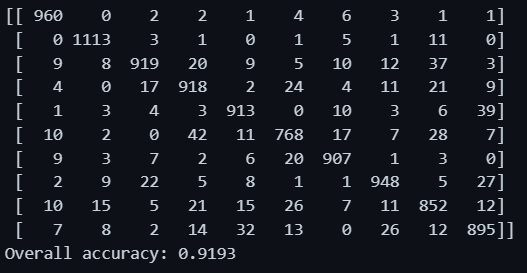

In this tutorial, you train a machine learning model on remote compute resources. You'll use the training and deployment workflow for Azure Machine Learning service (preview) in a Python Jupyter notebook.  You can then use the notebook as a template to train your own machine learning model with your own data. This tutorial is **part one of a two-part tutorial series**.

This tutorial trains a simple logistic regression using the [MNIST](https://docs.microsoft.com/azure/open-datasets/dataset-mnist) dataset and [scikit-learn](http://scikit-learn.org) with Azure Machine Learning.  MNIST is a popular dataset consisting of 70,000 grayscale images. Each image is a handwritten digit of 28x28 pixels, representing a number from 0 to 9. The goal is to create a multi-class classifier to identify the digit a given image represents.

**Learn how to:**

> * Set up your development environment
> * Access and examine the data
> * Train a simple logistic regression model on a remote cluster
> * Review training results, find and register the best model

To give your project a background in the portfolio page, just add the img tag to the front matter like so:

---

## **Prerequisites**

See prerequisites in the [Azure Machine Learning documentation](https://docs.microsoft.com/azure/machine-learning/service/tutorial-train-models-with-aml#prerequisites).

On the computer running this notebook, conda install matplotlib, numpy, scikit-learn=0.22.1

---

## **1.1 Set up your development environment**

All the setup for your development work can be accomplished in a Python notebook.  Setup includes:

* Importing Python packages

* Connecting to a workspace to enable communication between your local computer and remote resources

* Creating an experiment to track all your runs

* Creating a remote compute target to use for training

---

### **1.2 Import packages**

Import Python packages you need in this session. Also display the Azure Machine Learning SDK version.

```python
%matplotlib inline
import numpy as np
import matplotlib.pyplot as plt

import azureml.core
from azureml.core import Workspace

# check core SDK version number
print("Azure ML SDK Version: ", azureml.core.VERSION)
```

> Output: Azure ML SDK Version:  1.59.0

### **1.3 Connect to workspace**

Create a workspace object from the existing workspace. `Workspace.from_config()` reads the file **config.json** and loads the details into an object named `ws`.

```python
# load workspace configuration from the config.json file in the current folder.
ws = Workspace.from_config()
print(ws.name, ws.location, ws.resource_group, sep='\t')
```

> Name: WS000-CentralWorkSpace | Location: southafricanorth | Resource Group: RG000-Central_RG

### **1.4 Create experiment**

Create an experiment to track the runs in your workspace. A workspace can have muliple experiments.

```python
experiment_name = 'Tutorial-sklearn-mnist-Trial3'

from azureml.core import Experiment
exp = Experiment(workspace=ws, name=experiment_name)
print("Experiment name: ", exp.name)
```

> Experiment name:  Tutorial-sklearn-mnist-Trial3

---

### **1.5 Create or Attach existing compute resource**

By using Azure Machine Learning Compute, a managed service, data scientists can train machine learning models on clusters of Azure virtual machines. Examples include VMs with GPU support. In this tutorial, you create Azure Machine Learning Compute as your training environment. You will submit Python code to run on this VM later in the tutorial.

The code below creates the compute clusters for you if they don't already exist in your workspace.

**Creation of compute takes approximately 5 minutes.** If the AmlCompute with that name is already in your workspace the code will skip the creation process.

```python
from azureml.core.compute import AmlCompute
from azureml.core.compute import ComputeTarget
import os

# choose a name for your cluster
compute_name = os.environ.get("AML_COMPUTE_CLUSTER_NAME", "cpu-cluster")
compute_min_nodes = os.environ.get("AML_COMPUTE_CLUSTER_MIN_NODES", 0)
compute_max_nodes = os.environ.get("AML_COMPUTE_CLUSTER_MAX_NODES", 4)

# This example uses CPU VM. For using GPU VM, set SKU to Standard_NC6s_v3
vm_size = os.environ.get("AML_COMPUTE_CLUSTER_SKU", "STANDARD_D2_V2")


if compute_name in ws.compute_targets:
    compute_target = ws.compute_targets[compute_name]
    if compute_target and type(compute_target) is AmlCompute:
        print("found compute target: " + compute_name)
else:
    print("creating new compute target...")
    provisioning_config = AmlCompute.provisioning_configuration(vm_size = vm_size,
                                                                min_nodes = compute_min_nodes, 
                                                                max_nodes = compute_max_nodes)

    # create the cluster
    compute_target = ComputeTarget.create(ws, compute_name, provisioning_config)
    
    # can poll for a minimum number of nodes and for a specific timeout. 
    # if no min node count is provided it will use the scale settings for the cluster
    compute_target.wait_for_completion(show_output=True, min_node_count=None, timeout_in_minutes=20)
    
    # For a more detailed view of current AmlCompute status, use get_status()
    print(compute_target.get_status().serialize())
```

> Found compute target: cpu-cluster

You now have the necessary packages and compute resources to train a model in the cloud.

---

## **2. Explore data**

Before you train a model, you need to understand the data that you are using to train it. In this section you learn how to:

* Download the MNIST dataset

* Display some sample images

---

### **2.1 Download the MNIST dataset**

Use Azure Open Datasets to get the raw MNIST data files. [Azure Open Datasets](https://docs.microsoft.com/azure/open-datasets/overview-what-are-open-datasets) are curated public datasets that you can use to add scenario-specific features to machine learning solutions for more accurate models. Each dataset has a corrseponding class, `MNIST` in this case, to retrieve the data in different ways.

This code retrieves the data as a `FileDataset` object, which is a subclass of `Dataset`. A `FileDataset` references single or multiple files of any format in your datastores or public urls. The class provides you with the ability to download or mount the files to your compute by creating a reference to the data source location. Additionally, you register the Dataset to your workspace for easy retrieval during training.

Follow the [how-to](https://aka.ms/azureml/howto/createdatasets) to learn more about Datasets and their usage in the SDK.

```python
from azureml.core import Dataset # Core Azure ML class for working with datasets
from azureml.opendatasets import MNIST # Core Azure ML class for working with datasets

# Creates a 'data' subfolder in current directory
data_folder = os.path.join(os.getcwd(), 'data')
os.makedirs(data_folder, exist_ok=True) # True prevents errors if folder already exists


mnist_file_dataset = MNIST.get_file_dataset() # Creates a FileDataset object referencing MNIST data
mnist_file_dataset.download(data_folder, overwrite=True) # overwrite=True: Replaces existing files if present  *download(): Actually downloads files to local folder


# Dataset Registration: Registers dataset in Azure ML workspace for future use
mnist_file_dataset = mnist_file_dataset.register(workspace=ws, # Makes dataset discoverable and reusable in the workspace
                                                name='mnist_opendataset', # Creates new version if dataset already exists
                                                description='training and test dataset',
                                                create_new_version=True) # Returns registered dataset object
```

> {'infer_column_types': 'False', 'activity': 'download'}
> {'infer_column_types': 'False', 'activity': 'download', 'activityApp': 'FileDataset'}

---

### **2.3 Display some sample images**

Load the compressed files into `numpy` arrays. Then use `matplotlib` to plot 30 random images from the dataset with their labels above them. Note this step requires a `load_data` function that's included in an `utils.py` file. This file is included in the sample folder. Please make sure it is placed in the same folder as this notebook. The `load_data` function simply parses the compresse files into numpy arrays.

```python
from azureml.core import Dataset # Core Azure ML class for working with datasets
from azureml.opendatasets import MNIST # Core Azure ML class for working with datasets

# Creates a 'data' subfolder in current directory
data_folder = os.path.join(os.getcwd(), 'data')
os.makedirs(data_folder, exist_ok=True) # True prevents errors if folder already exists


mnist_file_dataset = MNIST.get_file_dataset() # Creates a FileDataset object referencing MNIST data
mnist_file_dataset.download(data_folder, overwrite=True) # overwrite=True: Replaces existing files if present  *download(): Actually downloads files to local folder


# Dataset Registration: Registers dataset in Azure ML workspace for future use
mnist_file_dataset = mnist_file_dataset.register(workspace=ws, # Makes dataset discoverable and reusable in the workspace
                                                name='mnist_opendataset', # Creates new version if dataset already exists
                                                description='training and test dataset',
                                                create_new_version=True) # Returns registered dataset object
```

```python
# make sure utils.py is in the same directory as this code
from utils import load_data
import glob


# note we also shrink the intensity values (X) from 0-255 to 0-1. This helps the model converge faster.
X_train = load_data(glob.glob(os.path.join(data_folder,"**/train-images-idx3-ubyte.gz"), recursive=True)[0], False) / 255.0
X_test = load_data(glob.glob(os.path.join(data_folder,"**/t10k-images-idx3-ubyte.gz"), recursive=True)[0], False) / 255.0
y_train = load_data(glob.glob(os.path.join(data_folder,"**/train-labels-idx1-ubyte.gz"), recursive=True)[0], True).reshape(-1)
y_test = load_data(glob.glob(os.path.join(data_folder,"**/t10k-labels-idx1-ubyte.gz"), recursive=True)[0], True).reshape(-1)


# now let's show some randomly chosen images from the traininng set.
count = 0
sample_size = 30
plt.figure(figsize = (16, 6))
for i in np.random.permutation(X_train.shape[0])[:sample_size]:
    count = count + 1
    plt.subplot(1, sample_size, count)
    plt.axhline('')
    plt.axvline('')
    plt.text(x=10, y=-10, s=y_train[i], fontsize=18)
    plt.imshow(X_train[i].reshape(28, 28), cmap=plt.cm.Greys)
plt.show()
```




---

## **4.0 Train on a remote cluster**

For this task, you submit the job to run on the remote training cluster you set up earlier.  To submit a job you:

* Create a directory

* Create a training script

* Create a script run configuration

* Submit the job

---

### **4.1 Create a directory**

Create a directory to deliver the necessary code from your computer to the remote resource.

```python
import os
script_folder = os.path.join(os.getcwd(), "sklearn-mnist-Trial3")
os.makedirs(script_folder, exist_ok=True)
```

---

### **4.2 Create a training script**

To submit the job to the cluster, first create a training script. Run the following code to create the training script called `train.py` in the directory you just created.

```python
%%writefile "$script_folder/train.py"


# a.) Imports and Setup
# Imports necessary libraries for ML, file handling, and Azure ML integration
import argparse
import os
import numpy as np
import glob

from sklearn.linear_model import LogisticRegression
import joblib

from azureml.core import Run
from utils import load_data


# b.) Argument Parsing
# let user feed in 2 parameters, the dataset to mount or download, and the regularization rate of the logistic regression model
parser = argparse.ArgumentParser()
parser.add_argument('--data-folder', type=str, dest='data_folder', help='data folder mounting point') # Where the MNIST data is stored
parser.add_argument('--regularization', type=float, dest='reg', default=0.01, help='regularization rate') # Hyperparameter for the logistic regression model
args = parser.parse_args()

data_folder = args.data_folder
print('Data folder:', data_folder)


# c.) Data Loading
# load train and test set into numpy arrays
# note we scale the pixel intensity values to 0-1 (by dividing it with 255.0) so the model can converge faster.
X_train = load_data(glob.glob(os.path.join(data_folder, '**/train-images-idx3-ubyte.gz'), recursive=True)[0], False) / 255.0 # Normalizes pixel values by dividing by 255.0 (scaling to 0-1 range)
X_test = load_data(glob.glob(os.path.join(data_folder, '**/t10k-images-idx3-ubyte.gz'), recursive=True)[0], False) / 255.0
y_train = load_data(glob.glob(os.path.join(data_folder, '**/train-labels-idx1-ubyte.gz'), recursive=True)[0], True).reshape(-1)
y_test = load_data(glob.glob(os.path.join(data_folder, '**/t10k-labels-idx1-ubyte.gz'), recursive=True)[0], True).reshape(-1)

print(X_train.shape, y_train.shape, X_test.shape, y_test.shape, sep = '\n')


# d.) Model Training
# get hold of the current run
run = Run.get_context()


# Creates and trains a logistic regression model
print('Train a logistic regression model with regularization rate of', args.reg)
clf = LogisticRegression(C=1.0/args.reg, solver="liblinear", multi_class="auto", random_state=42) # C=1.0/args.reg: Inverse of regularization strength
clf.fit(X_train, y_train) # Uses liblinear solver for multi-class classification


# e.) Evaluation and Logging
print('Predict the test set')
y_hat = clf.predict(X_test)

# Makes predictions on test set
# Logs metrics to Azure ML
acc = np.average(y_hat == y_test) # Calculates accuracy
print('Accuracy is', acc) # calculate accuracy on the prediction

run.log('regularization rate', np.float(args.reg))
run.log('accuracy', np.float(acc))


# f.) Model Saving
os.makedirs('outputs', exist_ok=True)
# note file saved in the outputs folder is automatically uploaded into experiment record
# Azure ML automatically uploads files in 'outputs' directory
joblib.dump(value=clf, filename='outputs/sklearn_mnist_model.pkl')
```

> Writing c:\Users\casie\Data Science Coding Folder\20. Azure Machine Learning Breakdown\001. image-classification-mnist\001. image-classification-mnist-part-one\sklearn-mnist-Trial3/train.py

Notice how the script gets data and saves models:

* The training script reads an argument to find the directory containing the data.  When you submit the job later, you point to the dataset for this argument:
`parser.add_argument('--data-folder', type=str, dest='data_folder', help='data directory mounting point')`

* The training script saves your model into a directory named outputs.

`joblib.dump(value=clf, filename='outputs/sklearn_mnist_model.pkl')`

Anything written in this directory is automatically uploaded into your workspace. You'll access your model from this directory later in the tutorial.

The file `utils.py` is referenced from the training script to load the dataset correctly.  Copy this script into the script folder so that it can be accessed along with the training script on the remote resource.

```python
import shutil
shutil.copy('utils.py', script_folder)
```

---

### **4.3 Configure the training job**

Create a ScriptRunConfig object to specify the configuration details of your training job, including your training script, environment to use, and the compute target to run on. Configure the ScriptRunConfig by specifying:

* The directory that contains your scripts. All the files in this directory are uploaded into the cluster nodes for execution.

* The compute target.  In this case you will use the AmlCompute you created

* The training script name, train.py

* An environment that contains the libraries needed to run the script

* Arguments required from the training script.

In this tutorial, the target is AmlCompute. All files in the script folder are uploaded into the cluster nodes for execution. The data_folder is set to use the dataset.

First, create the environment that contains: the scikit-learn library, azureml-dataset-runtime required for accessing the dataset, and azureml-defaults which contains the dependencies for logging metrics. The azureml-defaults also contains the dependencies required for deploying the model as a web service later in the part 2 of the tutorial.

Once the environment is defined, register it with the Workspace to re-use it in part 2 of the tutorial.

```python
from azureml.core import Workspace
from azureml.core.environment import Environment

# Connect to your workspace
ws = Workspace.from_config()

# Create environment from Conda specification file
env = Environment.from_conda_specification(name='ENV001-img_class-Trial3', file_path='conda.yml')

# Register environment to re-use later
env.register(workspace=ws)
```

```python
from azureml.core import Environment
env = Environment.get(workspace=ws, name='ENV001-img_class', version='4')
```

Then, create the ScriptRunConfig by specifying the training script, compute target and environment.

```python
from azureml.core import ScriptRunConfig

args = ['--data-folder', mnist_file_dataset.as_mount(), '--regularization', 0.5]

src = ScriptRunConfig(source_directory=script_folder,
                    script='train.py', 
                    arguments=args,
                    compute_target=compute_target,
                    environment=env)
```

---

### **4.4 Submit the training job**

Run the experiment by submitting the ScriptRunConfig object. And you can navigate to Azure portal to monitor the run.

```python
run = exp.submit(config=src)
run
```

<table style="width:100%"><tr><th>Experiment</th><th>Id</th><th>Type</th><th>Status</th><th>Details Page</th><th>Docs Page</th></tr><tr><td>Tutorial-sklearn-mnist-Trial3</td><td>Tutorial-sklearn-mnist-Trial3_1736683121_063ab3ab</td><td>azureml.scriptrun</td><td>Starting</td><td><a href="https://ml.azure.com/runs/Tutorial-sklearn-mnist-Trial3_1736683121_063ab3ab?wsid=/subscriptions/88187483-a72c-4f6a-83e5-43f1855302e1/resourcegroups/RG000-Central_RG/workspaces/WS000-CentralWorkSpace&amp;tid=35ac085b-7d42-4ede-8dc5-5178b0da3195" target="_blank" rel="noopener">Link to Azure Machine Learning studio</a></td><td><a href="https://docs.microsoft.com/en-us/python/api/azureml-core/azureml.core.script_run.ScriptRun?view=azure-ml-py" target="_blank" rel="noopener">Link to Documentation</a></td></tr></table>

Since the call is asynchronous, it returns a **Preparing** or **Running** state as soon as the job is started.

## **4.5 Monitor a remote run**

In total, the first run takes **approximately 10 minutes**. But for subsequent runs, as long as the dependencies in the Azure ML environment don't change, the same image is reused and hence the container start up time is much faster.

Here is what's happening while you wait:

**Image creation**: A Docker image is created matching the Python environment specified by the Azure ML environment. The image is built and stored in the ACR (Azure Container Registry) associated with your workspace. Image creation and uploading takes **about 5 minutes**.

This stage happens once for each Python environment since the container is cached for subsequent runs.  During image creation, logs are streamed to the run history. You can monitor the image creation progress using these logs

**Scaling**: If the remote cluster requires more nodes to execute the run than currently available, additional nodes are added automatically. Scaling typically takes **about 5 minutes.**

**Running**: In this stage, the necessary scripts and files are sent to the compute target, then data stores are mounted/copied, then the entry_script is run. While the job is running, stdout and the files in the ./logs directory are streamed to the run history. You can monitor the run's progress using these logs.

**Post-Processing**: The ./outputs directory of the run is copied over to the run history in your workspace so you can access these results.

You can check the progress of a running job in multiple ways. This tutorial uses a Jupyter widget as well as a `wait_for_completion` method.

### **4.6 Get log results upon completion**

Model training happens in the background. You can use `wait_for_completion` to block and wait until the model has completed training before running more code.

```python
# specify show_output to True for a verbose log
run.wait_for_completion(show_output=True) 
```

---

### **4.7 Display run results**

You now have a model trained on a remote cluster.  Retrieve all the metrics logged during the run, including the accuracy of the model:

```python
print(run.get_metrics())
```

> {'regularization rate': 0.5, 'accuracy': 0.9193}

In the next tutorial you will explore this model in more detail.

---

## **5.0 Register model**

The last step in the training script wrote the file `outputs/sklearn_mnist_model.pkl` in a directory named `outputs` in the VM of the cluster where the job is executed. `outputs` is a special directory in that all content in this  directory is automatically uploaded to your workspace.  This content appears in the run record in the experiment under your workspace. Hence, the model file is now also available in your workspace.

You can see files associated with that run.

```python
print(run.get_file_names())
```

Register the model in the workspace so that you (or other collaborators) can later query, examine, and deploy this model.

```python
# register model 
model = run.register_model(model_name='sklearn_mnist', model_path='outputs/sklearn_mnist_model.pkl')
print(model.name, model.id, model.version, sep='\t')
```

> sklearn_mnist	sklearn_mnist_1	1

---

## **SECTION TWO: Deploy an image classification model in Azure Container Instance (ACI)**

In this part of the tutorial, you use Azure Machine Learning service (Preview) to:

> * Set up your testing environment
> * Retrieve the model from your workspace
> * Test the model locally
> * Deploy the model to ACI
> * Test the deployed model

ACI is a great solution for testing and understanding the workflow. For scalable production deployments, consider using Azure Kubernetes Service. For more information, see [how to deploy and where](https://docs.microsoft.com/azure/machine-learning/v1/how-to-deploy-and-where).

---

## **5.1 Deploy as web service**

Deploy the model as a web service hosted in ACI.

To build the correct environment for ACI, provide the following:

* A scoring script to show how to use the model

* A configuration file to build the ACI

* The model you trained before

---

### **5.2 Create scoring script**

Create the scoring script, called score.py, used by the web service call to show how to use the model.

You must include two required functions into the scoring script:

* The `init()` function, which typically loads the model into a global object. This function is run only once when the Docker container is started.

* The `run(input_data)` function uses the model to predict a value based on the input data. Inputs and outputs to the run typically use JSON for serialization and de-serialization, but other formats are supported.

```python
%%writefile score.py
import json
import numpy as np
import os
import pickle
import joblib

def init():
    global model
    # AZUREML_MODEL_DIR is an environment variable created during deployment.
    # It is the path to the model folder (./azureml-models/$MODEL_NAME/$VERSION)
    # For multiple models, it points to the folder containing all deployed models (./azureml-models)
    model_path = os.path.join(os.getenv('AZUREML_MODEL_DIR'), 'sklearn_mnist_model.pkl')
    model = joblib.load(model_path)

def run(raw_data):
    data = np.array(json.loads(raw_data)['data'])
    # make prediction
    y_hat = model.predict(data)
    # you can return any data type as long as it is JSON-serializable
    return y_hat.tolist()
```

> Overwriting score.py

---

### **5.3 Create configuration file**

Create a deployment configuration file and specify the number of CPUs and gigabyte of RAM needed for your ACI container. While it depends on your model, the default of 1 core and 1 gigabyte of RAM is usually sufficient for many models. If you feel you need more later, you would have to recreate the image and redeploy the service.

```python
from azureml.core.webservice import AciWebservice

aciconfig = AciWebservice.deploy_configuration(cpu_cores=1, 
                                            memory_gb=1, 
                                            tags={"data": "MNIST",  "method" : "sklearn"}, 
                                            description='Predict MNIST with sklearn')
```

---

### **5.4 Deploy in ACI**

Estimated time to complete: **about 2-5 minutes**

Configure the image and deploy. The following code goes through these steps:

1. Create environment object containing dependencies needed by the model using the environment file (`myenv.yml`)
1. Create inference configuration necessary to deploy the model as a web service using:
   * The scoring file (`score.py`)
   * envrionment object created in previous step
1. Deploy the model to the ACI container.
1. Get the web service HTTP endpoint.

```python
%%time
import uuid
from azureml.core.webservice import Webservice
from azureml.core.model import InferenceConfig
from azureml.core.environment import Environment
from azureml.core import Workspace
from azureml.core.model import Model

ws = Workspace.from_config()
model = Model(ws, 'sklearn_mnist')


myenv = Environment.get(workspace=ws, name="ENV001-img_class-Trial3", version="1")
inference_config = InferenceConfig(entry_script="score.py", environment=myenv)

service_name = 'sklearn-mnist-svc-' + str(uuid.uuid4())[:4]
service = Model.deploy(workspace=ws, 
                    name=service_name, 
                    models=[model], 
                    inference_config=inference_config, 
                    deployment_config=aciconfig)

service.wait_for_deployment(show_output=True)
```

Get the scoring web service's HTTP endpoint, which accepts REST client calls. This endpoint can be shared with anyone who wants to test the web service or integrate it into an application.

```python
print(service.get_logs())
```

---

## **5.5 Test the model**

### **5.1 Download test data**

Download the test data to the **./data/** directory

```python
import os
from azureml.core import Dataset
from azureml.opendatasets import MNIST

data_folder = os.path.join(os.getcwd(), 'data')
os.makedirs(data_folder, exist_ok=True)

mnist_file_dataset = MNIST.get_file_dataset()
mnist_file_dataset.download(data_folder, overwrite=True)
```

---

### **4.2 Load test data**

Load the test data from the **./data/** directory created during the training tutorial.

```python
from utils import load_data
import os
import glob

data_folder = os.path.join(os.getcwd(), 'data')
# note we also shrink the intensity values (X) from 0-255 to 0-1. This helps the neural network converge faster
X_test = load_data(glob.glob(os.path.join(data_folder,"**/t10k-images-idx3-ubyte.gz"), recursive=True)[0], False) / 255.0
y_test = load_data(glob.glob(os.path.join(data_folder,"**/t10k-labels-idx1-ubyte.gz"), recursive=True)[0], True).reshape(-1)
```

```python
import json
test = json.dumps({"data": X_test.tolist()})
test = bytes(test, encoding='utf8')
y_hat = service.run(input_data=test)
```

```python
from sklearn.metrics import confusion_matrix

conf_mx = confusion_matrix(y_test, y_hat)
print(conf_mx)
print('Overall accuracy:', np.average(y_hat == y_test))
```


```python
# normalize the diagonal cells so that they don't overpower the rest of the cells when visualized
row_sums = conf_mx.sum(axis=1, keepdims=True)
norm_conf_mx = conf_mx / row_sums
np.fill_diagonal(norm_conf_mx, 0)

fig = plt.figure(figsize=(8,5))
ax = fig.add_subplot(111)
cax = ax.matshow(norm_conf_mx, cmap=plt.cm.bone)
ticks = np.arange(0, 10, 1)
ax.set_xticks(ticks)
ax.set_yticks(ticks)
ax.set_xticklabels(ticks)
ax.set_yticklabels(ticks)
fig.colorbar(cax)
plt.ylabel('true labels', fontsize=14)
plt.xlabel('predicted values', fontsize=14)
plt.savefig('conf.png')
plt.show()
```


```python
import json

# find 30 random samples from test set
n = 30
sample_indices = np.random.permutation(X_test.shape[0])[0:n]

test_samples = json.dumps({"data": X_test[sample_indices].tolist()})
test_samples = bytes(test_samples, encoding='utf8')

# predict using the deployed model
result = service.run(input_data=test_samples)

# compare actual value vs. the predicted values:
i = 0
plt.figure(figsize = (20, 1))

for s in sample_indices:
    plt.subplot(1, n, i + 1)
    plt.axhline('')
    plt.axvline('')
    
    # use different color for misclassified sample
    font_color = 'red' if y_test[s] != result[i] else 'black'
    clr_map = plt.cm.gray if y_test[s] != result[i] else plt.cm.Greys
    
    plt.text(x=10, y =-10, s=result[i], fontsize=18, color=font_color)
    plt.imshow(X_test[s].reshape(28, 28), cmap=clr_map)
    
    i = i + 1
plt.show()
```


```python
import requests

# send a random row from the test set to score
random_index = np.random.randint(0, len(X_test)-1)
input_data = "{\"data\": [" + str(list(X_test[random_index])) + "]}"

headers = {'Content-Type':'application/json'}

# for AKS deployment you'd need to the service key in the header as well
# api_key = service.get_key()
# headers = {'Content-Type':'application/json',  'Authorization':('Bearer '+ api_key)} 

resp = requests.post(service.scoring_uri, input_data, headers=headers)

print("POST to url", service.scoring_uri)
#print("input data:", input_data)
print("label:", y_test[random_index])
print("prediction:", resp.text)

```

<div class="row">
    <div class="col-sm mt-3 mt-md-0">
        
    </div>
    <div class="col-sm mt-3 mt-md-0">
        
    </div>
    <div class="col-sm mt-3 mt-md-0">
        
    </div>
</div>
<div class="caption">
    Caption photos easily. On the left, a road goes through a tunnel. Middle, leaves artistically fall in a hipster photoshoot. Right, in another hipster photoshoot, a lumberjack grasps a handful of pine needles.
</div>
<div class="row">
    <div class="col-sm mt-3 mt-md-0">
        
    </div>
</div>
<div class="caption">
    This image can also have a caption. It's like magic.
</div>

You can also put regular text between your rows of images.
Say you wanted to write a little bit about your project before you posted the rest of the images.
You describe how you toiled, sweated, _bled_ for your project, and then... you reveal its glory in the next row of images.

<div class="row justify-content-sm-center">
    <div class="col-sm-8 mt-3 mt-md-0">
        
    </div>
    <div class="col-sm-4 mt-3 mt-md-0">
        
    </div>
</div>
<div class="caption">
    You can also have artistically styled 2/3 + 1/3 images, like these.
</div>

The code is simple.
Just wrap your images with `<div class="col-sm">` and place them inside `<div class="row">` (read more about the <a href="https://getbootstrap.com/docs/4.4/layout/grid/">Bootstrap Grid</a> system).
To make images responsive, add `img-fluid` class to each; for rounded corners and shadows use `rounded` and `z-depth-1` classes.
Here's the code for the last row of images above:



```html
<div class="row justify-content-sm-center">
  <div class="col-sm-8 mt-3 mt-md-0">
    
  </div>
  <div class="col-sm-4 mt-3 mt-md-0">
    
  </div>
</div>
```


